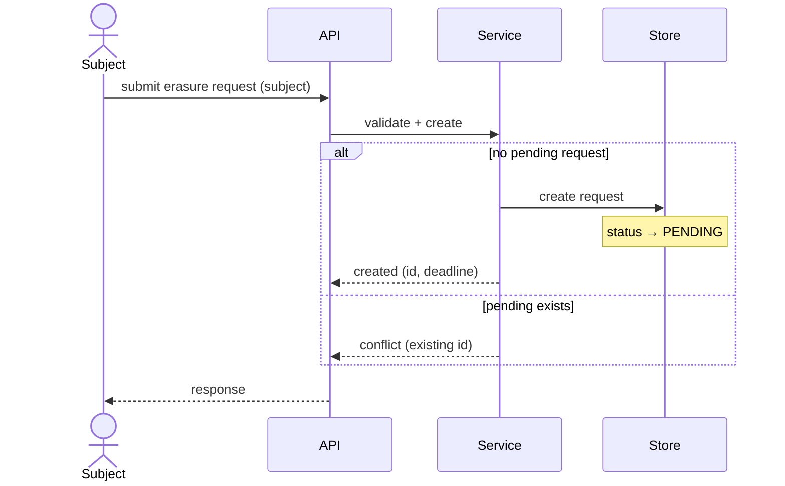

# Design: <feature title>

slug: <kebab-slug>
status: draft | approved
spec: ./spec.md

## Components
| Name | Responsibility | Location | Status |
|---|---|---|---|
| <Component> | <one line> | <path or "external"> | existing \| (new) |

## Sequence diagrams

### <Flow name>

### Not diagrammed
- S-NN.M — <reason: same interaction as S-NN.1 with different data>

## Contracts
### API
| Method | Path | Serves | Request | Response |
|---|---|---|---|---|
| POST | /... | REQ-01 | <shape> | <shape / errors> |

### Events
| Name | Direction | Serves | Payload |
|---|---|---|---|

### Data
<migration sketch: new entities, columns, indexes — or None — <why>>

### Configuration / permissions
- None — <why>

## Decisions
### D-01: <title>
- Context: <one line>
- Decision: <one line>
- Alternatives: <option> — rejected because <reason>
- Consequences: <easier: ...; harder: ...>

## Risks
- [<risk>] → <mitigation>
- [partial failure mid-flow] → <mitigation>
- [rollback] → <how>

## UI notes
- None — <why> | <screens/states referencing S-IDs>

## Test hooks
- <Exception S-ID>: <how to force it under test, e.g. "notifier fake configured to raise">
- <Async outcome>: <how to observe it>
