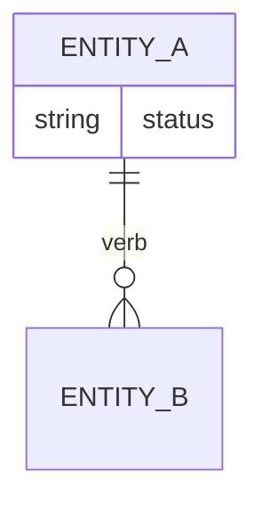
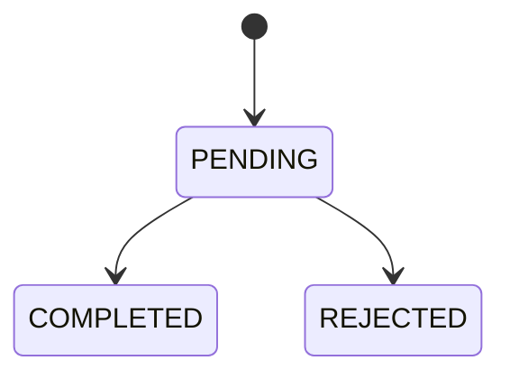

# Domain: <product name>

updated: <YYYY-MM-DD>

## Glossary
| Term | Definition | Notes |
|---|---|---|
| <Term> | <one sentence, in the user's words> | <synonyms to avoid, disambiguation> |

## Entities and relationships

## Lifecycles
### <Entity>

Transition rules:
- PENDING → COMPLETED: <who/what triggers it>

## Invariants
- INV-01: <rule that must always hold, entity-level, testable>
