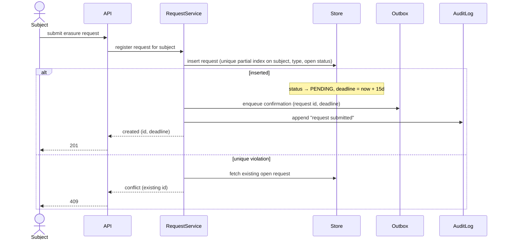
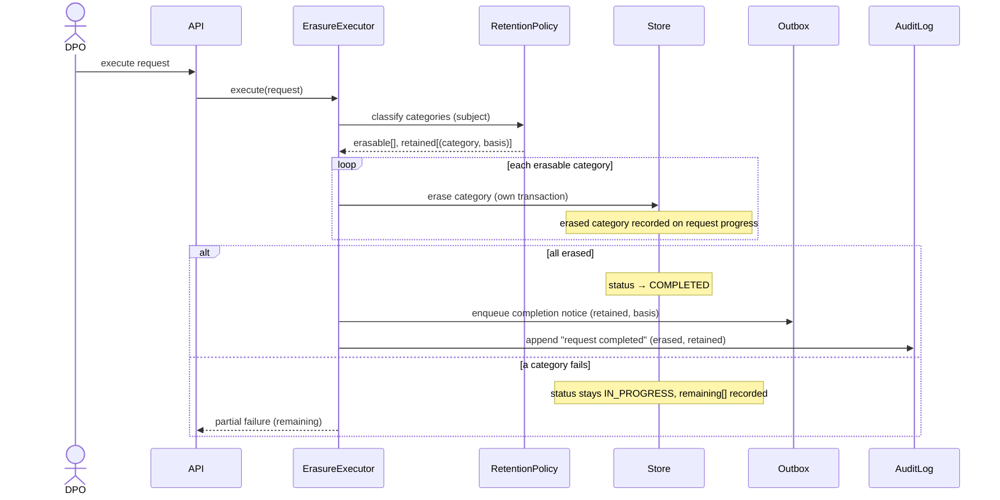

# Design: Erasure request

| Field | Value |
|---|---|
| slug | erasure-request |
| status | approved |
| spec | ./spec.md |

## Components
| Name | Responsibility | Location | Status |
|---|---|---|---|
| Portal | Subject-facing UI, submits requests | apps/portal | existing |
| API | HTTP surface, auth, validation | src/api | existing |
| RequestService | Request lifecycle, deadline calc, INV-01 | src/requests/service.py | (new) |
| ErasureExecutor | Category-by-category erasure honouring retention rules | src/requests/erasure.py | (new) |
| RetentionPolicy | Which categories are under obligation, legal basis | src/retention/policy.py | (new) |
| Store | Postgres via SQLAlchemy | src/db | existing |
| Outbox | Transactional outbox + worker for notifier calls | src/outbox | (new) |
| Notifier | External email provider | external | existing |
| AuditLog | Append-only audit events | src/audit | existing |

## Sequence diagrams

### Submission


### Confirmation delivery failure
```mermaid
sequenceDiagram
    %% covers S-01.3
    participant Outbox
    participant Notifier
    participant Store
    Outbox->>Notifier: send confirmation
    Notifier-->>Outbox: error
    Outbox->>Store: mark outbox row failed, increment attempts, set next_attempt
    Note over Store: request stays PENDING; failed row visible on DPO dashboard
```

### Execution


### Not diagrammed
- None

## Contracts
### API
| Method | Path | Serves | Request | Response |
|---|---|---|---|---|
| POST | /v1/requests/erasure | REQ-01 | (auth cookie) | 201 {id, deadline} / 409 {existing_id} |
| POST | /v1/requests/{id}/execute | REQ-02 | (DPO auth) | 200 {erased[], retained[]} / 409 {remaining[]} |

### Events
| Name | Direction | Serves | Payload |
|---|---|---|---|
| outbox.confirmation | internal | REQ-01 | request_id, deadline |
| outbox.completion | internal | REQ-02 | request_id, retained[(category, basis)] |

### Data
- `requests` (new): id, subject_id, type, status, deadline, created_at
- partial unique index on (subject_id, type) where status in (PENDING, IN_PROGRESS) — enforces INV-01 and X-01
- `request_progress` (new): request_id, category, state (erased|failed|pending), updated_at
- `outbox` (new): id, kind, payload, attempts, next_attempt_at, failed

### Configuration / permissions
- `ERASURE_DEADLINE_DAYS=15`
- DPO role required for execute

## Decisions
### D-01: Enforce INV-01 with a partial unique index, not an application check
- Context: concurrent duplicate submissions (X-01) must yield one Request.
- Decision: rely on a partial unique index and treat the violation as the duplicate path.
- Alternatives: check-then-insert in the service — rejected because it races under concurrency.
- Consequences: easier: X-01 is free; harder: the duplicate path needs a second read to return the existing id.

### D-02: Transactional outbox for notifier calls
- Context: X-02 requires acknowledging within 2s regardless of notifier latency, and S-01.3 requires visible retries.
- Decision: write notifications to an outbox in the same transaction; a worker delivers and records attempts.
- Alternatives: call the notifier inline — rejected because it couples latency and makes failure invisible.
- Consequences: easier: retries and visibility; harder: one more worker to operate.

### D-03: Per-category transactions during erasure
- Context: S-02.3 requires already-erased categories to stay erased on failure.
- Decision: erase each category in its own transaction and record progress.
- Alternatives: one big transaction — rejected because a rollback would resurrect erased data and contradict the audit trail.
- Consequences: easier: resumable execution; harder: partial state must be shown to the DPO.

## Risks
- [partial failure mid-flow in execution] → per-category progress rows; execute is idempotent and resumes from remaining[]
- [rollback of the feature] → tables are additive; disable the portal entry point; no data migration to reverse
- [notifier down for hours] → outbox backs off; DPO dashboard shows failed rows; deadline unaffected
- [retention policy misclassifies a category] → policy is data-driven and covered by T-02.1b; audit event records the basis used

## UI notes
- Portal: "Request erasure" action → success state with id + deadline (S-01.1); conflict state showing existing id (S-01.2)
- DPO dashboard (separate feature) surfaces outbox failures and remaining categories

## Test hooks
- S-01.3: Notifier fake configured to raise; run outbox worker once; inspect outbox row; advance a fake clock past 24h and run again to observe the DPO alert
- S-02.3: Store fake raising on a chosen category; inspect request_progress
- X-01: two concurrent submissions via thread pool against a real Postgres
- X-02: Notifier fake with 5s sleep; measure API latency
- Async outcomes: run the outbox worker synchronously in tests via `run_outbox_once()`
