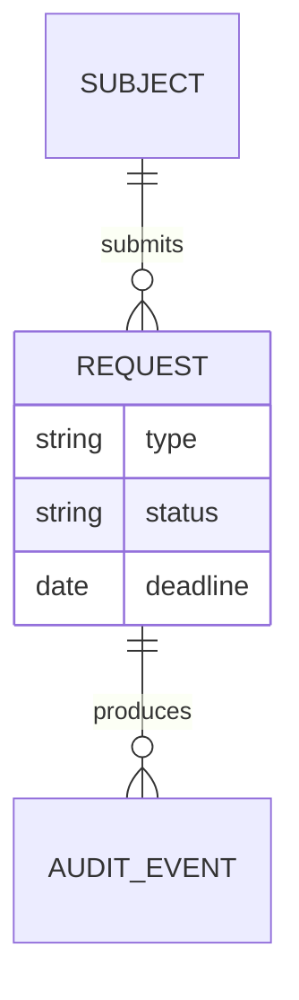
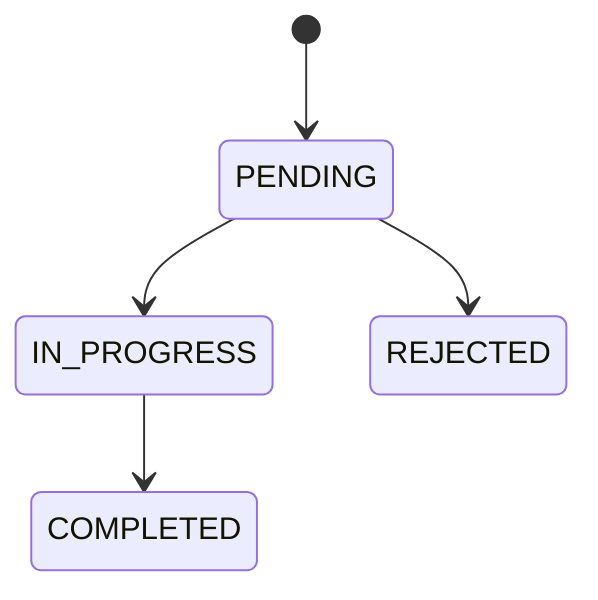

# Domain: Lacre (example excerpt)

updated: 2026-08-31

## Glossary
| Term | Definition | Notes |
|---|---|---|
| Subject | A natural person whose personal data the business holds | not "user"; users are DPOs |
| Request | A data-subject request under LGPD (access, correction, erasure) | not "ticket" |
| Retention obligation | A legal rule requiring certain data categories to be kept | e.g. fiscal records, 5 years |
| Completion notice | Message sent to the subject when a request is fulfilled | |

## Entities and relationships

## Lifecycles
### Request

Transition rules:
- PENDING → IN_PROGRESS: DPO starts execution
- IN_PROGRESS → COMPLETED: all erasable categories erased and notice sent
- PENDING → REJECTED: DPO rejects with a stated reason

## Invariants
- INV-01: A subject has at most one request of a given type in PENDING or IN_PROGRESS.
- INV-02: Data under a retention obligation is never erased by a request.
